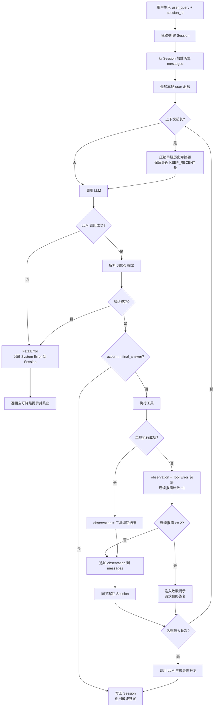
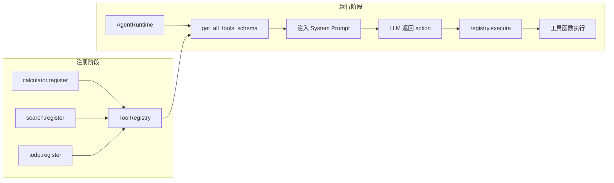

# Agent Demo

一个基于 **ReAct 范式**的极简 Python LLM Agent 框架，支持工具调用、会话隔离、上下文压缩与完善的异常处理。

- **LLM**：DeepSeek（OpenAI 兼容协议）
- **范式**：ReAct（Thought → Action → Observation 循环）
- **特性**：工具注册机制、多用户 Session 隔离、上下文自动压缩、可恢复/不可恢复错误分级处理

---

## 目录

- [快速开始](#快速开始)
- [系统设计](#系统设计)
- [Memory 的召回时机与放置方式](#memory-的召回时机与放置方式)
- [AI Prompt 与问题解决记录](#ai-prompt-与问题解决记录)
- [项目结构](#项目结构)
- [测试](#测试)

---

## 快速开始

### 1. 环境要求

- Python 3.9+（开发使用 conda 环境，Python 3.11.13）
- 一个 DeepSeek API Key

### 2. 创建虚拟环境

```bash
# 使用 conda（推荐）
conda create -n agent-demo python=3.11 -y
conda activate agent-demo
```

### 3. 安装依赖

```bash
pip install -r requirements.txt
```

依赖说明：

| 依赖 | 用途 |
|------|------|
| `openai` | 调用 DeepSeek 的 OpenAI 兼容 API |
| `python-dotenv` | 从 `.env` 加载 API Key |
| `asteval` | calculator 工具的安全数学表达式求值 |
| `pytest` | 单元测试框架 |

### 4. 配置 API Key

```bash
cp .env.example .env
# 编辑 .env，填入你的真实 Key
```

`.env` 文件内容：

```bash
DEEPSEEK_API_KEY=sk-xxxxxxxx
```

> 安全说明：`.env` 已被 `.gitignore` 忽略，**不会被提交到 git**。请勿将真实 Key 硬编码到源码中。

### 5. 启动命令

**方式一：快速体验（内置示例）**

```bash
python llm_client.py          # 直接测试 LLM 连通性
```

**方式二：运行完整 Agent**

```python
from llm_client import LLMClient
from tool_registry import ToolRegistry
from tools import register_all_tools
from agent_runtime import AgentRuntime

# 初始化工具注册表并注册全部具象工具
registry = ToolRegistry()
register_all_tools(registry)

# 创建 Agent
agent = AgentRuntime(
    llm=LLMClient(),
    registry=registry,
    max_iterations=10,          # 最大循环轮次
    max_context_chars=4000,     # 上下文压缩阈值
    keep_recent_messages=4,     # 压缩时保留最近消息数
)

# 对话（传入 session_id 实现多用户隔离）
answer = agent.run("请帮我计算 123 乘以 456 等于多少", session_id="user-1")
print(answer)
```

---

## 系统设计

### 架构总览

系统由四个核心模块组成：

| 模块 | 文件 | 职责 |
|------|------|------|
| LLM 客户端 | `llm_client.py` | 封装 DeepSeek API，仅返回原始文本 |
| 工具注册机制 | `tool_registry.py` | `ToolRegistry` + `@tool` 装饰器 |
| 具象工具 | `tools/` | calculator / search / todo |
| Agent 运行时 | `agent_runtime.py` | ReAct 主循环 + 异常处理 + 上下文管理 |
| Session 管理 | `session.py` | 多用户会话隔离 |

### 主循环流程（ReAct）



### 工具注册机制



**注册流程**：每个具象工具模块暴露 `register(registry)` 函数，通过 `@tool` 装饰器把 `name`、`description`、`parameters`（JSON Schema）和实际函数注册到 `ToolRegistry`。`tools/__init__.py` 的 `register_all_tools()` 统一完成全部注册。

**Schema 导出**：`get_all_tools_schema()` 返回 OpenAI function-calling 格式的工具列表，被序列化为 JSON 注入到 System Prompt 中，供 LLM 决策调用哪个工具。

```json
[
  {
    "type": "function",
    "function": {
      "name": "calculator",
      "description": "安全计算数学表达式...",
      "parameters": { "type": "object", "properties": {...}, "required": [...] }
    }
  }
]
```

---

## Memory 的召回时机与放置方式

本项目的 Memory 即 Session 中的 `messages` 历史列表。核心问题有两个：**何时把历史塞回**、**采用什么压缩策略**。

### 1. 召回时机（何时塞回）

历史对话在**每次 `run()` 调用开始**时被召回：

```python
def run(self, user_query, session_id=None):
    if session_id is not None:
        session = self.session_manager.get_or_create(session_id)  # 1. 定位 session
        messages = session.get_history()                          # 2. 召回历史
    messages.append({"role": "user", "content": user_query})      # 3. 追加本轮输入
```

**放置位置**：召回的历史 + 本轮 user 消息，构成完整的 `messages` 列表，作为 `llm.chat(messages=...)` 的输入。多轮 ReAct 循环中的中间产物（assistant 的 JSON 输出、工具的 observation）也会持续追加到这个列表。

**写回时机**：

| 时机 | 动作 |
|------|------|
| 工具执行后 | `_sync_session()` 将最新 messages 同步写回 session（确保后续追问能感知刚才的工具结果/错误） |
| 产出 final_answer | 将 user 问题 + assistant 最终答案写入 session |
| 致命错误 | 写入一条 `system` role 的 System Error 消息 |

### 2. 压缩策略（节省 token）

当 messages 总字符数超过 `max_context_chars`（默认 4000）时触发压缩：

```
压缩前:  [msg1, msg2, msg3, ..., msgN-1, msgN]   （总字符数 > 阈值）
                │
                │ 拆分为「老旧历史」+「最近保留部分」
                ▼
老旧历史:  [msg1, msg2, ..., msgN-KEEP]  → 交给 LLM 总结为一段摘要
最近保留:  [msgN-KEEP+1, ..., msgN]      → 原样保留

压缩后:  [{system: "以下是之前对话的摘要：\n..."}, ...最近保留的消息]
```

**关键设计**：

1. **摘要替代**：老旧历史被 LLM 压缩为一段摘要，用一条 `system` 消息替代，大幅减少 token。
2. **保留最近 N 条**：`keep_recent_messages`（默认 4）保证最近的对话（尤其是**工具执行结果 observation**）不被丢弃，维持连贯性。
3. **摘要内容要求**：摘要 prompt 明确要求"保留关键事实、用户意图、以及所有工具调用及其结果"。
4. **失败降级**：摘要生成失败时，退化为简单截断（保留旧历史末尾 500 字符），不中断主流程。

**压缩时机**：在每次 ReAct 循环迭代**开始、调用 LLM 之前**执行 `_maybe_compress()`，确保发送给 LLM 的上下文始终在预算内。

---

## AI Prompt 与问题解决记录

本节整理开发过程中给 AI 的任务 Prompt，以及遇到的主要报错与修复过程。

### 1. 任务 Prompt 演进记录

| 阶段 | Prompt 核心诉求 | 产出 |
|------|----------------|------|
| 1 | 封装 LLM 客户端，支持 System Prompt、Messages、温度/token 参数，仅返回原始文本 | `llm_client.py` |
| 2 | 用 conda 创建 `agent-demo` 环境并安装依赖 | conda 环境 + 依赖 |
| 3 | API Key 安全处理 | `.env` + `python-dotenv` + `.gitignore` |
| 4 | 实现工具注册机制（name/description/parameters + schema 导出 + execute） | `tool_registry.py` |
| 5 | 实现 ReAct 主循环（强制 JSON 输出、解析、循环调用、异常处理、trace 日志） | `agent_runtime.py` |
| 6 | 三个具象工具（calculator 安全求值、search mock、todo CRUD） | `tools/` 目录 |
| 7 | Session 管理（多用户窗口隔离） | `session.py` |
| 8 | 区分可恢复/不可恢复错误（Tool Error 前缀、致命错误降级、连续报错计数） | 异常处理重构 |
| 9 | context 管理（最大轮次、压缩策略、工具结果保留） | 上下文压缩 |
| 10 | 编写 pytest 单元测试 + 详细测试文档 | `tests/` |
| 11 | 真实 LLM API 集成测试 + 文档 | `tests/test_integration_real_api.py` |

### 2. 遇到的问题与修复过程

#### 问题 1：系统 Python 3.8 无法安装新版 openai

**现象**：`pip install openai` 报错 `No matching distribution found for jiter<1,>=0.10.0`。

**原因**：系统默认 Python 3.8.2，pip 版本 19.2.3 过旧，且新版 `openai` 依赖的 `jiter` 已停止支持 Python 3.8。

**修复**：改用 conda 创建 Python 3.11 独立环境，在其中安装依赖。

#### 问题 2：conda 清华镜像源 403

**现象**：`conda create` 报 `HTTP 403 FORBIDDEN for channel anaconda/cloud/conda-forge`。

**原因**：`~/.condarc` 中配置的清华镜像源 `cloud/conda-forge` 路径已失效。

**修复**：使用 `--override-channels -c defaults` 临时切到官方源完成安装，未改动用户全局配置。

#### 问题 3：tools.py 与 tools/ 目录命名冲突

**现象**：需要把具象工具放在 `tools/` 目录，但已有注册机制模块 `tools.py`，同名冲突。

**修复**：将注册机制 `tools.py` 重命名为 `tool_registry.py`，`tools/` 目录放具象工具，并同步更新所有 import。

#### 问题 4：final_answer 分支重复追加 user 消息

**现象**：Session 历史中出现重复的 user 消息（`[0]` 和 `[3]` 内容相同）。

**原因**：`run()` 在 `final_answer` 分支既保留了 messages 中的 user 输入，又额外 `add_message("user", user_query)`。

**状态**：已记录为已知行为，不影响功能，待后续优化。

#### 问题 5：FakeLLM 响应耗尽导致测试失败

**现象**：`test_compress_triggered_in_long_conversation` 报 `FakeLLM 响应已耗尽`。

**原因**：压缩触发后 `_summarize` 也会调用一次 LLM，但测试只准备了 2 个响应（主循环 + 最终答复），未给摘要调用预留。

**修复**：为摘要调用额外准备 1 个响应，共 3 个。

#### 问题 6：测试中缺少 AgentRuntime 导入

**现象**：`test_session.py` 报 `NameError: name 'AgentRuntime' is not defined`。

**修复**：补充 `from agent_runtime import AgentRuntime`。

---

## 项目结构

```
agent-demo/
├── agent_runtime.py            # ReAct 主循环 + 异常处理 + 上下文管理
├── llm_client.py               # DeepSeek LLM 客户端封装
├── tool_registry.py            # 工具注册机制（ToolRegistry + @tool）
├── session.py                  # Session / SessionManager（多用户隔离）
├── tools/                      # 具象工具包
│   ├── __init__.py             # register_all_tools 统一注册入口
│   ├── calculator.py           # 安全数学计算（asteval）
│   ├── search.py               # 模拟搜索 API（MOCK）
│   └── todo.py                 # 待办事项 CRUD
├── tests/                      # 测试套件
│   ├── conftest.py             # fixtures（FakeLLM 等）
│   ├── test_tools.py           # 工具注册 + 具象工具
│   ├── test_agent_runtime.py   # 主循环解析 + 异常处理
│   ├── test_session.py         # Session 隔离性
│   ├── test_context.py         # context 压缩
│   ├── test_integration_real_api.py  # 真实 API 集成测试
│   ├── README.md               # 单元测试文档
│   └── README_integration.md   # 集成测试文档
├── .env.example                # API Key 模板
├── .gitignore
├── pytest.ini                  # pytest 配置（默认忽略集成测试）
├── requirements.txt
└── README.md                   # 本文档
```

---

## 测试

```bash
# 单元测试（FakeLLM，不调用真实 API）
pytest -q

# 真实 API 集成测试（消耗 token）
pytest tests/test_integration_real_api.py -m integration -v
```

- 单元测试：**41 个用例全部通过**
- 集成测试：**3 个用例全部通过**（真实调用 DeepSeek API）

详细测试过程与输入输出结构见 [`tests/README.md`](tests/README.md) 和 [`tests/README_integration.md`](tests/README_integration.md)。
